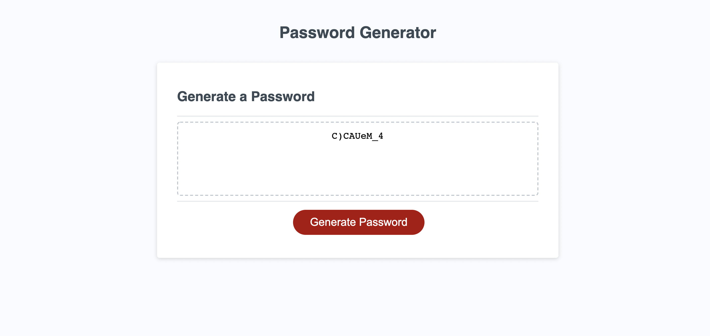
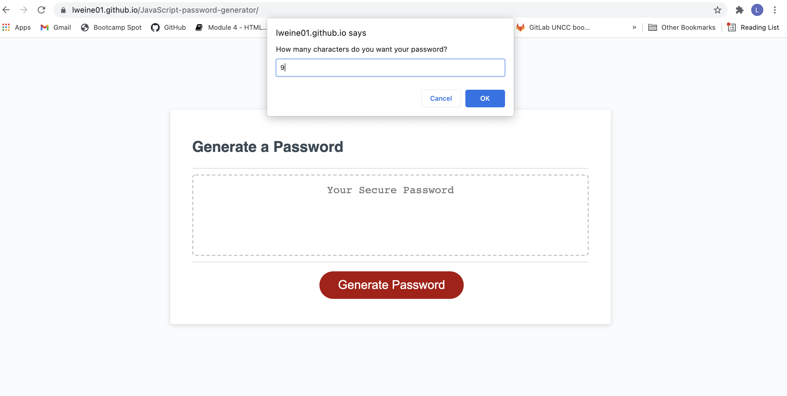

JavaScript Password Generator

[Link to finished website](https://lweine01.github.io/JavaScript-password-generator/)

## Table of Contents
- [Description](#Description)
- [Screenshot](#Screenshot)
- [Usage](#Usage)
- [License](#License)
- [Language](#language)
- [Contact](#Contact)

## Description
In this project I created a random password generator. When you click the generate password button a series of prompts come up. First, the user must select the number of characters they want. Then they need to confirm if they want Upper Case, Lower Case, Special Characters, Numbers or not. Then the password will appear. In order to ensure that ever desired character type is in the password we stored one random element from each confirmed type and added to the end of the password.

## Screenshot

## Usage
Allows a user to create a secure and random password.

## License
MIT

## Language
HTML, CSS and Javascript

## Contact
LauraRWeiner@gmail.com
